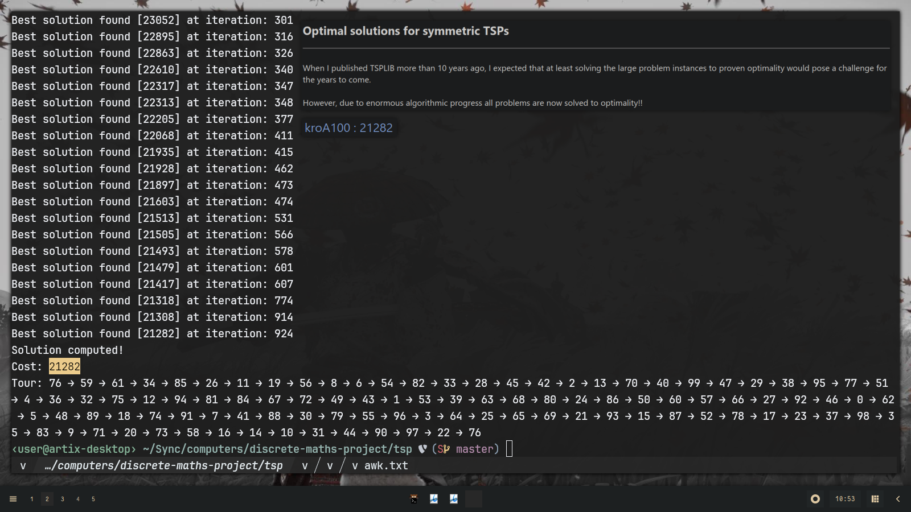
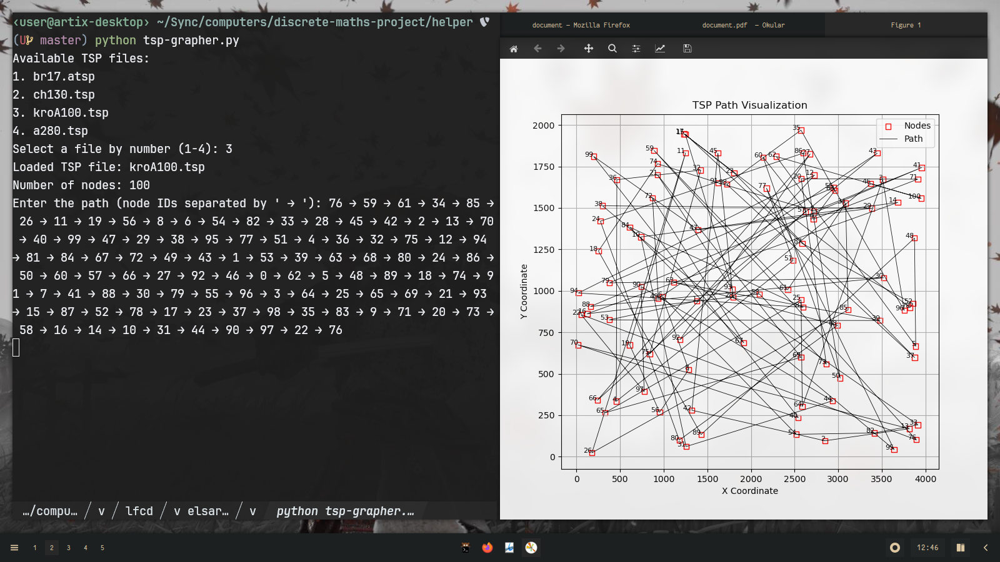

# Problema del viajante (TSP)

Uff que esto tomó más tiempo de lo esperado.

### Justificación

La idea del proyecto es tener un visualizador con diferentes mecanismos para resolver el problema del viajante el cual es notorio por ser NP-completo y sus miríadas de aplicaciones.

### Estado del proyecto

La parte más importante del proyecto está hecha, una interfaz general que permite crear múltiples mecanismos de resolución para el problema del viajante.

Los mecanismos de resolución que este proyecto tiene como objetivo implementar es fuerza bruta, MMAS, y Physarum polycephalum. MMAS que es uno de los mecanismos más interesantes, está implementado actualmente y su uso se encuentra dentro del `main`.

### Detalles de uso

El `main` permite seleccionar instancias TSP o ATSP de formato [TSPLIB](http://comopt.ifi.uni-heidelberg.de/software/TSPLIB95) que el usuario debe descargar y guardar bajo el directorio `$XDG_DATA_HOME/tsp/instances`. Una vez que el usuario selecciona una instancia, el programa procede a resolverla usando MMAS.

En caso de que no se le haya distribuido un binario, como requisito para correr el programa, necesita un compilador `nightly` de Rust actualizado; ejecute el programa con: `cargo r --release`.

> De momento solo se ha probado calcular la solución del TSP de la instancia simétrica kroA100, la cual da resultados satisfactorios con un error mínimo del valor actual; por aquello, no se garantiza resultados remarcables en otras instancias.

> El usuario siempre tiene la opción de comparar la solución encontrada por el algoritmo con la solución óptima en: <http://comopt.ifi.uni-heidelberg.de/software/TSPLIB95>.

### Hechos intersantes sobre MMAS

-   La calidad de solución es sorprendente, considerando que tiene complejidad temporal subcuadrática, órdenes de magnitud mejor que el acercamiento *naive* (fuerza bruta) cuya complejidad temporal es factorial.
-   Pese a que MMAS fue aplicado al problema del viajante, este es más versátil y puede ser aplicado a cualquier problema de optimización combinatorio siempre y cuando este defina componentes solución, es decir, se puede desglosar el problema iterativamente.

### Avances a futuro

El autor planea seguir trabajando en el proyecto. Pese a esta noción es importante mencionar que el estado actual del proyecto ya es merecedora de una calificación satisfactoria (A). De todos modos, estas serán las áreas que se trabajaran:

-   Interfaz gráfica con el motor de juegos Bevy.
    -   Gráfica de nodos, ruta y construcciones específicas a cada mecanismo de resolución (ej: para MMAS: rastro de feromonas).
    -   Input para customización de parámetros por parte del usuario.
    -   Estadísticas de rendimiento del mecanismo de resolución (entropía, iteraciones-costo).
-   Implementación de los mecanismos de resolución: Physarum polycephalum, fuerza bruta.

> Este documento se actualizará en: <https://yuuhikaze.github.io/static/dmath.html>
>
> El programa se actualizará en: <https://github.com/yuuhikaze/tsp>

### Cortesía de la casa

Como de momento no hay forma de visualizar los procesos del algoritmo, al menos se provee un script de Python para que el usuario pueda visualizar la ruta encontrada en el mapa de nodos seleccionado. Como requisito se necesita tener `matplotlib` instalado y para la ejecución se usa el siguiente comando: `python3 tsp-grapher.py`.

> Orgullosamente el autor puede aclamar que solo uso AI para este script (por limitaciones de tiempo).

# Referencias

\Begin{hangparas}{1.27cm}{1}

Stützle, T., & Dorigo, M. (1999). ACO algorithms for the traveling salesman problem. Evolutionary Algorithms in Engineering and Computer Science, 4, 163–183. <http://staff.washington.edu/paymana/swarm/stutzle99-eaecs.pdf>

Stützle, T., & Hoos, H. H. (2000). MAX-MIN Ant System. Future Generation Computer Systems, 16(8), 889–914. <https://doi.org/10.1016/S0167-739X(00)00043-1>

RSkinderowicz. (2024). RSkinderowicz/MAX-MIN-Ant-System [C++]. <https://github.com/RSkinderowicz/MAX-MIN-Ant-System> (Original work published 2018)

\End{hangparas}
